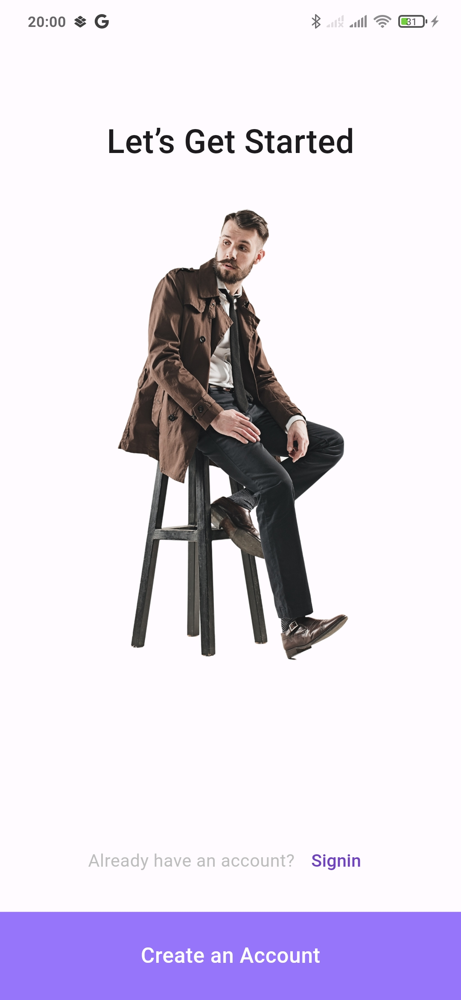
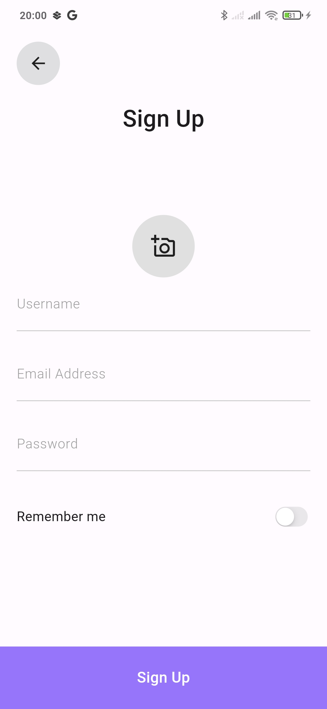
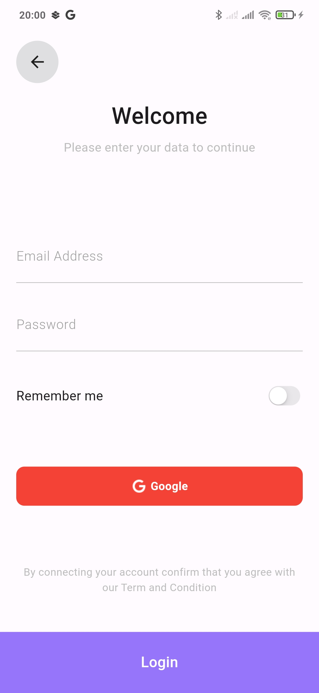
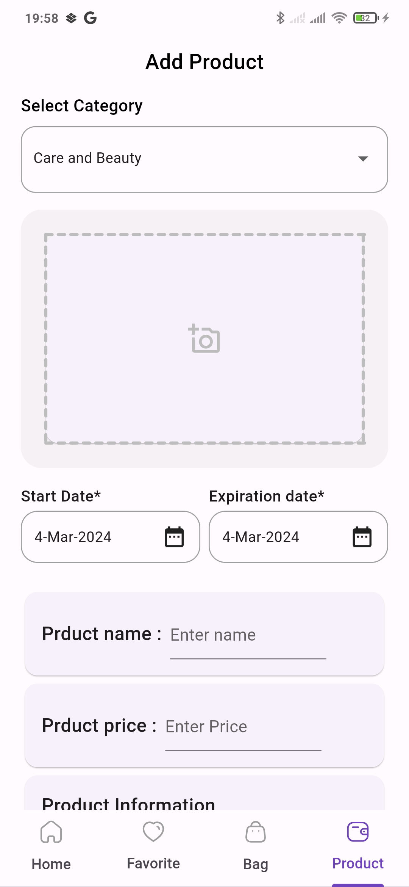
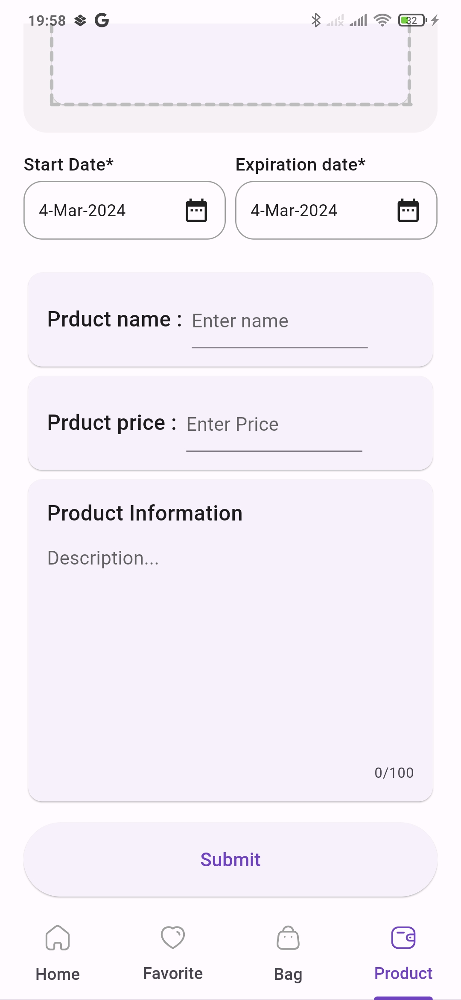
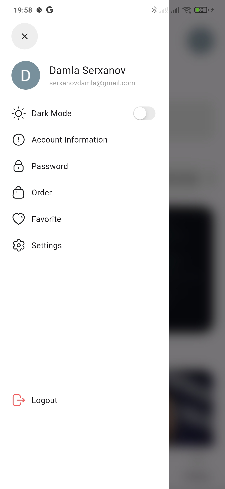

# Laza commerce
An ecommerce app allows users to shop online, browse product catalogs, create wish lists, add items to a cart, and complete purchases. It also provides payment processing, shipping, and order management capabilities.

## Getting Started
### Dependencies Packages:
* Dependency Injection - get it
* StateManagment - Bloc, Provider
* Sign Provider - Google Sign
* Network Storage - Firebase Auth, Firebase Storage, Firebase FireStore
* File Pick - Image Picker
* Generate uid - Uuid
* Generate code - Build runner
* Sound - Audio Players
* Local Storage - Shared Preferences
* Date - initl

  
## UI/UX 
### App Icon

### Splash Page

### Auth pages
  

    
    
    
    
  

### Add Prduct
  

    
    
  

### Drawer 
  

    
  

